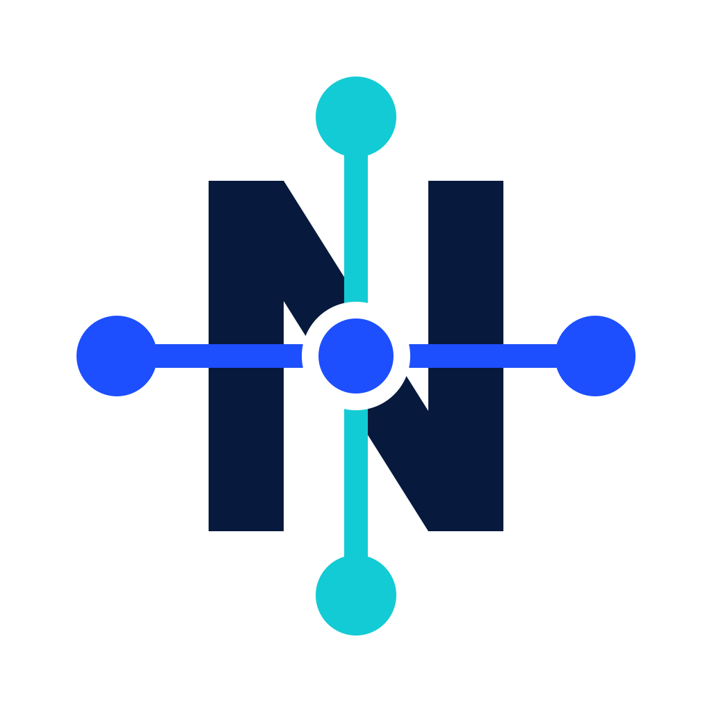

<div align="center">
  
  <h1>Nexo</h1>
  <p><strong>Un punto común de acceso a modelos de IA para todas tus aplicaciones.</strong></p>
</div>

Nexo es una aplicación de escritorio que expone un **gateway local compatible con OpenAI**. Conectas tus cuentas una vez en Nexo y tus herramientas apuntan a `http://127.0.0.1:8787/v1` con un token propio, en lugar de repartir API keys por todas partes.

Su razón de ser es usar la **suscripción que ya pagas** —empezando por ChatGPT— desde cualquier aplicación, sin volver a pagar por token. Y como contrapartida, registrar localmente qué aplicación usa qué modelo, con qué latencia y con qué consumo.

```text
Tus aplicaciones  ──►  Nexo (localhost)  ──►  ChatGPT por suscripción
                          │                    OpenAI por API key
                          │                    LM Studio, en tu equipo
                          └── SQLite local: uso, latencia, errores, coste
```

> [!WARNING]
> **La vía de suscripción no es un mecanismo soportado por OpenAI.** Nexo reutiliza el flujo OAuth de su cliente oficial: funciona hoy, puede romperse sin aviso, y usarla puede incumplir las condiciones del servicio con consecuencias sobre tu cuenta. La decisión, los riesgos y sus mitigaciones están en el [ADR 0001](docs/adr/0001-oauth-de-suscripcion.md). Nexo te pide aceptar este aviso antes del primer login y exige un límite por aplicación en esa vía.

## Estado

Primera versión funcional. Lo que hay hoy:

| | Estado |
| --- | --- |
| Gateway `chat/completions` con y sin streaming | ✅ |
| Traducción `chat/completions` ↔ formato Responses | ✅ |
| ChatGPT por OAuth de suscripción | ✅ **validado contra una cuenta real** el 2026-07-31 |
| OpenAI por API key, y como respaldo automático | ✅ |
| Proveedor mock para probar sin credenciales | ✅ |
| Tokens por aplicación, revocables, con límites | ✅ |
| Credenciales en el Keychain del sistema | ✅ |
| Catálogo descubierto del proveedor, no clavado a mano | ✅ |
| Estadísticas locales y panel | ✅ |
| Icono en la barra de estado, cierre sin parar el gateway | ✅ |
| Modelos locales con LM Studio, detectado solo | ✅ **verificado** contra LM Studio 0.4.20 |
| Google Gemini, Anthropic, Ollama, MLX, llama.cpp | ⬜ ver [ROADMAP](ROADMAP.md) |

## Requisitos

- Rust estable (probado con 1.96)
- Node.js 20 o superior
- macOS 11+ con las Command Line Tools de Xcode

Windows y Linux están contemplados en la arquitectura pero todavía no se han probado.

## Probar sin compilar la aplicación

Dos caminos que no requieren construir la app de escritorio.

**1. La batería de pruebas.** Cubre el gateway completo por HTTP real, incluida la traducción de formatos, los límites y las estadísticas:

```bash
cargo test -p nexo-core
```

**2. El gateway sin interfaz.** Arranca solo el núcleo, emite un token y concede acceso al proveedor mock, que no sale de tu máquina:

```bash
cargo run -p nexo-core --example gateway_headless
```

Imprime en pantalla el token y los `curl` listos para copiar. Con `NEXO_PORT=9787` cambias el puerto si el 8787 está ocupado.

## Compilar la aplicación

```bash
npm install
npm run tauri build
```

Los artefactos aparecen bajo `target/release/`:

| Artefacto | Ruta | Tamaño aprox. |
| --- | --- | --- |
| Binario | `target/release/nexo` | 9 MB |
| Aplicación macOS | `target/release/bundle/macos/Nexo.app` | 9 MB |
| Instalador macOS | `target/release/bundle/dmg/Nexo_0.1.0_aarch64.dmg` | 4 MB |

Para generar solo uno: `npm run tauri build -- --bundles app` (o `dmg`, `nsis`, `deb`, `appimage`).

> El bundle DMG falla si queda un volumen `Nexo` montado o un `rw.*.dmg` a medias de un intento anterior. Se arregla con `hdiutil detach /Volumes/Nexo` y `rm -f target/release/bundle/*/rw.*.dmg`. Ojo: construir solo el DMG (`--bundles dmg`) borra el `Nexo.app` existente, así que si quieres los dos, pídelos en la misma orden.

Nada de esto se versiona: `target/`, `node_modules/`, `dist/` y los instaladores están en [.gitignore](.gitignore).

## Cómo se desarrolla aquí

Nexo usa **desarrollo dirigido por especificación**: nada sustancial se implementa
sin una especificación escrita y acordada antes. No es burocracia — es el sitio
donde se descubre que el problema no era el que parecía, antes de gastar código en
el equivocado.

El ciclo está automatizado como órdenes de Claude Code. Tú pides lo que quieres en
tus palabras; si falta información, se te hacen **como máximo 3 preguntas cortas
con la opción recomendada marcada**, y con eso se escribe la especificación.

```
/spec quiero conectar los modelos que tengo en LM Studio
   ↓   (preguntas cortas si hacen falta)  →  specs/0001-…/spec.md
/design                                   →  specs/0001-…/design.md
/tasks                                    →  specs/0001-…/tasks.md
/build                                    →  código, con las tareas tachándose
```

| Orden | Qué hace |
| --- | --- |
| `/spec <lo que quieres>` | Pregunta lo que falte y escribe el qué y el por qué |
| `/design` | Convierte el qué en el cómo, con las alternativas descartadas |
| `/tasks` | Descompone en tareas verificables, sin dejar el repo roto entre ellas |
| `/build` | Implementa, ejecutando la verificación de cada tarea |
| `/spec-status` | En qué punto está cada especificación, y qué incoherencias hay |

Dos reglas que hacen que esto sirva de algo:

- **Los criterios de aceptación son ejecutables.** «Debe ser rápido» no es un
  criterio. «`GET /v1/models` responde en menos de 200 ms, medido con `cargo test
  …`» sí. `/build` no marca una tarea hasta que su verificación pasa de verdad.
- **Lo que se descubre vuelve al documento.** Si al implementar resulta que la
  especificación estaba equivocada, se corrige y se anota qué se aprendió. Ya ha
  pasado tres veces en este proyecto.
- **Toda implementación acaba con el artefacto de macOS reconstruido.** Las pruebas
  verdes no demuestran que la aplicación empaquete, y lo que se instala es el paquete.

Las especificaciones viven en [`specs/`](specs/), la metodología completa en
[`.claude/skills/spec-driven/SKILL.md`](.claude/skills/spec-driven/SKILL.md), y las
invariantes que ninguna especificación puede romper en [`CLAUDE.md`](CLAUDE.md).

Para lo trivial y reversible (una errata, un texto, un formateo) no hace falta el
ciclo. Un arreglo de fallo tampoco, pero sí una prueba que lo reproduzca antes.

## Desarrollo

```bash
npm run tauri dev
```

Compila Rust en modo debug y sirve la interfaz con recarga en caliente. `npm run dev` a secas levanta solo Vite, pero la interfaz no funciona fuera del WebView de Tauri porque todos los datos llegan por comandos del núcleo.

Comprobaciones antes de commitear:

```bash
cargo test --workspace && cargo clippy --workspace --all-targets && npm run check
```

Variables útiles:

- `NEXO_LOG=debug` sube el nivel de log.
- `NEXO_DATA_DIR=/ruta` cambia dónde vive la base de datos, práctico para no tocar tus datos reales al probar.

## Usarlo

1. **Conecta una cuenta** en la pestaña *Proveedores*. Para ChatGPT tendrás que aceptar el aviso de riesgo y completar el login en el navegador; el callback vuelve a `http://localhost:1455`.
2. **Crea una aplicación** en la pestaña *Aplicaciones*. Copia el token: Nexo guarda solo su hash y no puede volver a mostrártelo.
3. **Concede acceso** a la vía que quieras usar. En la de suscripción, el límite por aplicación es obligatorio.
4. **Apunta tu herramienta** a la URL base y el token:

```bash
curl -N http://127.0.0.1:8787/v1/chat/completions \
  -H 'Authorization: Bearer nx_tu_token' \
  -H 'content-type: application/json' \
  -d '{"model":"openai/gpt-5.5","messages":[{"role":"user","content":"hola"}],"stream":true}'
```

Los nombres de modelo llevan siempre el proveedor delante. `GET /v1/models` devuelve los disponibles para ese token, cada uno con un bloque `nexo` que declara la vía de acceso, su contabilidad y sus capacidades reales.

Cerrar la ventana **no** detiene Nexo: el gateway sigue sirviendo y el icono permanece en la barra de estado, desde donde puedes pausarlo, reanudarlo o salir.

## Estructura

```text
crates/nexo-core/     Núcleo: gateway, adaptadores, OAuth, políticas, SQLite
  src/auth/chatgpt.rs   Módulo frágil: todo lo que puede romperse, aislado aquí
  src/provider/         Contrato de proveedor y los tres adaptadores
  src/translate/        chat/completions ↔ Responses
  tests/                Pruebas de extremo a extremo por HTTP
src-tauri/            Capa de escritorio: bandeja, ciclo de vida, comandos
src/                  Interfaz Svelte 5
assets/icons/         Sistema de iconos (ver su propio README)
docs/                 Producto, decisiones y contratos
specs/                Especificaciones de cada cambio
.claude/              Metodología automatizada: órdenes y skill
scripts/              Utilidades del repositorio
```

Todo lo que el gateway necesita para funcionar vive en Rust. La interfaz solo presenta y envía acciones: por eso Nexo sigue operativo sin ventana abierta.

## Documentación

| Documento | Contenido |
| --- | --- |
| [docs/producto.md](docs/producto.md) | Qué problema resuelve, visión y características |
| [ROADMAP.md](ROADMAP.md) | Alcance, fases y criterios de aceptación |
| [docs/adr/0001-oauth-de-suscripcion.md](docs/adr/0001-oauth-de-suscripcion.md) | Por qué se usa un mecanismo no soportado y a qué riesgos obliga |
| [docs/adr/0002-stack-tauri-rust-svelte.md](docs/adr/0002-stack-tauri-rust-svelte.md) | Stack, objetivos numéricos y mediciones |
| [docs/contrato-proveedor.md](docs/contrato-proveedor.md) | Cómo se añade un proveedor |
| [docs/modelo-datos.md](docs/modelo-datos.md) | Esquema SQLite |
| [CLAUDE.md](CLAUDE.md) | Metodología, verificación e invariantes que no se negocian |
| [specs/](specs/) | Especificaciones de cada cambio, con su diseño y sus tareas |

## Privacidad

- Los secretos viven en el almacén seguro del sistema operativo, nunca en SQLite ni en ficheros de texto.
- Los prompts y las respuestas **no** se guardan por defecto.
- El gateway escucha solo en `127.0.0.1`. La exposición en red está desactivada y no se habilitará sin autenticación, autorización y transporte seguro.
- Las estadísticas no salen del equipo. Puedes configurar la retención y borrarlas desde *Configuración*.
- Cuando un proveedor no informa de tokens, coste o cuota, Nexo lo marca como no disponible en lugar de inventar una cifra. Un coste cubierto por suscripción se distingue explícitamente de un coste cero.

## Licencia

[MIT](LICENSE).
